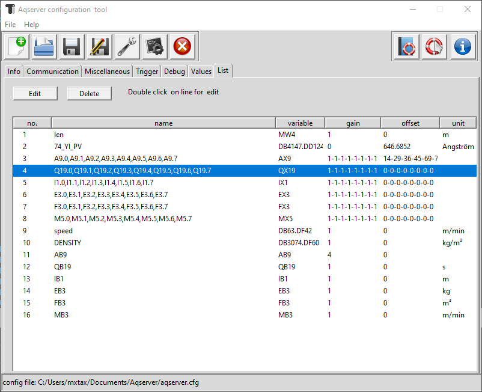

List tab
===================

1. Edit
	Edit the selected value/row from the list. Will open this value in the values tab
2. Delete
	Deletes the selected value from the list. Has to be confirmed.
	
.. note:: Deleting a value from the list can destroy the display of a datafile in KST2,
	because it is based on the order of the values in the datafiel. When we change the 
	order by deleting a value from the list, then display will not work anymore.

