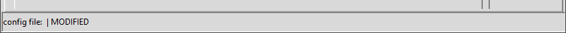

Main interface
===================

Menu and toolbar
------------------

.. image:: images/toolbar.png
    :align: center
    :alt: Values
	
Menu and toolbar show the same functions. left part of the toolbar shows the 
File menu functions, right part shows the Help menu functions.

1. File	
	1. New

		.. image:: images/btn-document-new.png
			:align: left
			:alt: New
			:width: 32px
			:height: 32 px

		Clears all fields for a fresh config file
	2. Open ...

		.. image:: images/btn-document-open.png
			:align: left
			:alt: Open
			:width: 32px
			:height: 32 px

		Opens an existing configuration file
	3. Save

		.. image:: images/btn-document-save.png
			:align: left
			:alt: Save
			:width: 32px
			:height: 32 px

		Save the open file
	4. Save as ...

		.. image:: images/btn-document-save-as.png
			:align: left
			:alt: Save as ...
			:width: 32px
			:height: 32 px
			
		Lets you save the open file under a new name
		
	5. Settings

		.. image:: images/btn-configure.png
			:align: left
			:alt: Settings
			:width: 32px
			:height: 32 px
			
		Opens a new dialog window, where you can adjust the program settings
		
	6. Save \*.bat

		.. image:: images/btn-ms_dos_batch_file.png
			:align: left
			:alt: Save \*.bat
			:width: 32px
			:height: 32 px

		Saves a batch file next to the config file, that you can use to start
		Aqserver directly with this config-file
		
	7. Quit

		.. image:: images/btn-close.png
			:align: left
			:alt: Quit
			:width: 32px
			:height: 32 px

		Closes the configuration program
		
2. Help
	8. Help contents

		.. image:: images/btn-help-contents.png
			:align: left
			:alt: Help
			:width: 32px
			:height: 32 px

		Opens the help file i a browser
		
	9. Context help

		.. image:: images/btn-help-contextual.png
			:align: left
			:alt: Context help
			:width: 32px
			:height: 32 px

		switches the mouse pointer to a arrow with question mark. Click on a element
		in the interface and help for this element will be displayed in the browser
		
	10. About

		.. image:: images/btn-help-about.png
			:align: left
			:alt: About
			:width: 32px
			:height: 32 px

		Shows an About box for the program
		

Statusbar
-----------

	
The statusbar shows the name of the open config file and whether it has been modified

