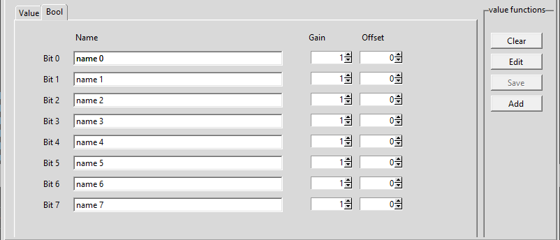

Values tab
===================

Values
--------

.. image:: images/06_value.png
    :align: left
    :alt: Values
	
1. Area of values	
	select the area of the value from the following
	
	a. Data
		value is from the data area, you have to select also a datablock number and the address
	b. Output
		value is from the output area, you have to select also  the address.
		Note that datablock number is greyed out.
	c. Input
		value is from the input area, you have to select also  the address.
		Note that datablock number is greyed out.
	d. Flag
		value is from the flag area, you have to select also  the address.
		Note that datablock number is greyed out.
	e. Timer
		value is from the timer area, you have to select also  the address.
		Note that datablock number is greyed out.
		Also the only allowed format is Int 16 bit
	f. Counter
		value is from the counter area, you have to select also  the address.
		Note that datablock number is greyed out.
		Also the only allowed format is Int 16 bit
		
2. Data block number
	enter / select the number of the datablock
3. Address
	enter the address of the value
4. Format
	select the format of the value with the radio buttons
	
	a. Real 32 bit
		value is a real (float) number , with a length of 32 bit (REAL)
		Note that bottom notebook switches automatically to the value tab.	
	b. Dint 32 bit
		value is a integer number, with a length of 32 bit (DINT)
		Note that bottom notebook switches automatically to the value tab.	
	c. Int 16 bit
		value is a integer number, with a length of 16 bit (WORD)
		Note that bottom notebook switches automatically to the value tab.	
	d. Int 8 bit
		value is a integer number, with a length of 8 bit (BYTE)
		Note that bottom notebook switches automatically to the value tab.	
	e. Bool
		value is a boolean value (TRUE/FALSE). Note that bottom notebook
		switches automatically to the bool tab.

Value 
########

.. image:: images/06_values-value.png
    :align: left
    :alt: Values
	
1. Name
	The name for the value

	.. note:: Names have to be unique. No duplicate entries are allowed in the list!

2. Gain
	The value coming from the PLC is multiplied with this value
	This can be used if several signals have to be compared 
	but have different range (but maybe the same shape). Leave 1.0 for no effect (default setting). 
3. Offset
	This value is added to the result of (value coming from the PLC multiplied by gain)
	Use this to shift the value up or down. Leave 0.0 for no effect (default setting)
4. Unit
	Enter a unit of the measured value, e.g. m³, bar, psi...

Bool
########	

Smallest value that can be read from the PLC is a Byte. 
So in order to get a boolean value we have to get a byte and then separate it to 8 booleans.

1. name for every bit
	The name for the bits (also unique)

2. Gain for every bit
	Gain does not make much sense, but we have it anyway. Leave 1 for no effect (default setting)
3. Offset for every bit
	This value is added to the result of (value coming from the PLC multiplied by gain).
	Can be useful if several boolean values are in one graph, to separate them. 
	Leave 0 for no effect (default setting)
	
.. note:: There is no unit for a boolean value

Buttons
########
1. Clear
	This button clears the entry fields and sets some defaults
2. Edit
	This button switches to the list tab, sop you select a value/row for edit
3. Save
	Changes to a selected value will be saved to the list.
	If no value was selected previously , then button is greyed out
4. Add
	Values entered to the fields will be added to the end of the list
	
Duplicate names
^^^^^^^^^^^^^^^^^^
All value names must be unique. If a name entered to the Name field 
or to the Name0..7 field for the boolean is already in the list, a 
dialog will open and show the duplicates. Enter a different name for the shown ones 
and save/add again.

.. image:: images/dialog-duplicate.png
    :align: left
    :alt: Duplicate names

